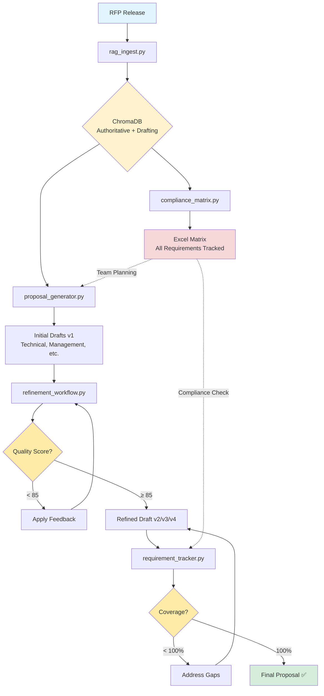

# Complete Federal Proposal Generation Workflow

## Phase 1: Intake
**RFP Release** → `rag_ingest.py` → **ChromaDB**

Documents are processed and semantic roles assigned:
- evaluation_criteria
- technical_requirements
- instructions
- past_performance

## Phase 2: Compliance Planning
**ChromaDB** → `compliance_matrix.py` → **Excel Matrix**

All "shall/must/will" requirements extracted:
- Categorized (Technical, Management, Personnel, Security)
- Tracked for compliance
- Assigned to proposal writers

## Phase 3: Initial Drafting
**ChromaDB** → `proposal_generator.py` → **Initial Drafts (v1)**

AI generates first-pass sections:
- Technical Approach
- Management Plan
- Past Performance
- Executive Summary

## Phase 4: Iterative Refinement
**Draft v1** → `refinement_workflow.py` → **Refined Drafts (v2, v3, v4...)**

Multi-round improvement loop:
1. Analyze draft (compliance, quality, completeness)
2. Apply feedback (automated or manual)
3. Regenerate improved version
4. Calculate quality score (0-100)
5. Repeat until score ≥ 85

## Phase 5: Coverage Verification
**Refined Drafts** → `requirement_tracker.py` → **Coverage Report**

Verify all requirements addressed:
- Maps requirements → proposal sections
- Identifies gaps (missing coverage)
- Generates compliance report
- Ensures 100% before submission

## Phase 6: Submission
**Coverage = 100%** + **Quality ≥ 85** = **Final Proposal ✅**

---

## Tool Summary

| Tool | Purpose | Input | Output | When to Use |
|------|---------|-------|--------|-------------|
| **compliance_matrix.py** | Extract & track requirements | RFP in DB | Excel matrix | Day 1 after RFP |
| **proposal_generator.py** | Generate initial sections | Opportunity + type | Word draft v1 | Week 1 drafting |
| **refinement_workflow.py** | Improve draft quality | Draft + feedback | Refined v2/v3/v4 | Week 2 improvement |
| **requirement_tracker.py** | Verify coverage | Drafts + RFP | Coverage report | Week 3 verification |

---

## Key Metrics

✅ **Compliance Matrix**: Extracts 50-200 requirements per RFP  
✅ **Proposal Generator**: Creates 2-4 section drafts per opportunity  
✅ **Refinement Workflow**: Improves quality score by +10-20 points  
✅ **Requirement Tracker**: Verifies 100% coverage before submission

---

## Success Criteria

🟢 **Ready for Submission:**
- All requirements addressed (100% coverage)
- Quality scores ≥ 85 for all sections
- Compliance matrix fully populated
- Version history documented

🟡 **Needs Work:**
- Coverage 80-99% (gaps exist)
- Quality scores 70-84 (good but improvable)
- Some requirements not mapped to sections

🔴 **Not Ready:**
- Coverage < 80% (major gaps)
- Quality scores < 70 (needs significant work)
- Compliance matrix incomplete
